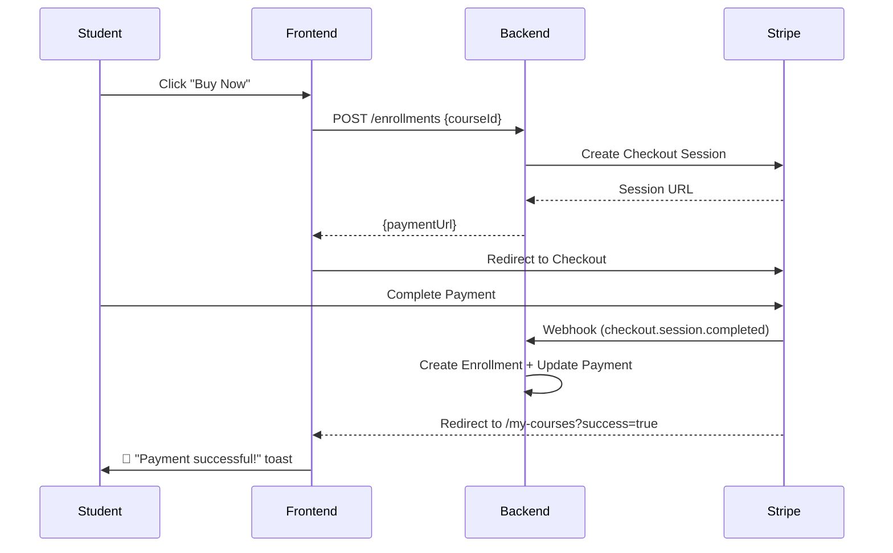

<p align="center">
  
  
  
  
  
  
</p>

# 🎓 CourseMaster — Frontend

> A stunning, production-grade online learning platform UI — built with **Next.js 16**, **React 19**, **RTK Query**, and **Tailwind CSS 4**.

---

## ✨ Features

| Feature | Description |
|---|---|
| 🏠 **Landing Page** | Hero section, featured courses, testimonials, trust bar |
| 🔐 **Authentication** | Login / Signup forms with JWT token management |
| 📚 **Course Catalog** | Browse all courses with search, filter, pagination |
| 📖 **Course Details** | Rich course page with curriculum, pricing, enrollment |
| 🎬 **Course Player** | Full video player with sidebar curriculum navigator |
| ⏭️ **Next/Previous Nav** | Navigate through lessons, quizzes & assignments |
| 📝 **Assignment Submission** | Write & submit text/link assignments inline |
| 🧠 **Quiz Engine** | Interactive quiz with option selection & auto-grading |
| ✅ **Progress Tracking** | Lesson completion with linear unlock, progress bars |
| 💳 **Stripe Checkout** | Seamless payment flow for paid courses |
| 📊 **Student Dashboard** | My courses, analytics, certificates |
| 🛠️ **Instructor Dashboard** | Course management, lesson/quiz/assignment CRUD |
| 👨‍💼 **Admin Dashboard** | User management, course oversight, stats |
| 🌐 **i18n Ready** | Internationalization support built-in |
| 🎨 **Dark/Light Mode** | Full theme support with Tailwind CSS |
| 📱 **Fully Responsive** | Mobile-first, looks great on every device |

---

## 📁 Project Structure

```
courseMaster-frontend/
├── public/                        # Static assets
├── src/
│   ├── app/
│   │   ├── (AuthLayout)/          # Login / Signup pages
│   │   │   ├── login/page.tsx
│   │   │   └── signup/page.tsx
│   │   ├── (commonLayout)/        # Public pages (with Navbar + Footer)
│   │   │   ├── page.tsx           # Landing / Home page
│   │   │   ├── about/page.tsx
│   │   │   ├── contact/page.tsx
│   │   │   └── courses/
│   │   │       ├── page.tsx       # Course catalog
│   │   │       └── [id]/page.tsx  # Course details + enrollment
│   │   ├── (dashboardLayout)/     # Protected dashboard pages
│   │   │   ├── layout.tsx         # Sidebar + header layout
│   │   │   ├── dashboard/
│   │   │   │   ├── admin/         # Admin pages
│   │   │   │   ├── instructor/    # Instructor course management
│   │   │   │   └── student/
│   │   │   │       ├── my-courses/page.tsx
│   │   │   │       ├── analytics/page.tsx
│   │   │   │       └── certificate/[id]/page.tsx
│   │   │   └── course/
│   │   │       └── [id]/
│   │   │           └── player/page.tsx  # 🎬 Course Player
│   │   ├── globals.css
│   │   └── layout.tsx             # Root layout
│   ├── components/
│   │   ├── hero.tsx               # Landing hero section
│   │   ├── FeaturedCourses.tsx    # Featured courses carousel
│   │   ├── Testimonials.tsx       # Marquee testimonials
│   │   ├── ContactSection.tsx     # Contact form
│   │   ├── TrustBar.tsx           # Trust indicators
│   │   ├── CoursePlayer.tsx       # Legacy player component
│   │   ├── student-dashboard.tsx  # Student dashboard view
│   │   ├── instructor-dashboard.tsx
│   │   ├── admin-dashboard.tsx
│   │   ├── admin-stats.tsx
│   │   ├── admin-courses-table.tsx
│   │   ├── admin-users-table.tsx
│   │   ├── course-detail-view.tsx
│   │   ├── progress-bar.tsx
│   │   ├── auth-Form/             # Auth form components
│   │   ├── course-form/           # Course creation form
│   │   ├── dashboard/             # Dashboard sidebar
│   │   ├── shared/                # Shared components (Navbar, Footer)
│   │   └── ui/                    # shadcn/ui primitives
│   ├── redux/
│   │   ├── baseApi/
│   │   │   └── baseApi.ts         # RTK Query base with auth
│   │   ├── features/
│   │   │   ├── auth/              # Auth slice + API
│   │   │   ├── course/courseAPi.ts # Course CRUD + enrollment hooks
│   │   │   ├── enroll/enrollApi.ts # Enrollment + submission hooks
│   │   │   ├── category/          # Category API
│   │   │   ├── module/            # Module API
│   │   │   ├── lesson/            # Lesson API
│   │   │   ├── dashboard/         # Dashboard stats API
│   │   │   ├── review/            # Reviews API
│   │   │   └── user/              # User management API
│   │   └── store.ts               # Redux store config
│   ├── interfaces/                # TypeScript interfaces
│   ├── hooks/                     # Custom React hooks
│   ├── lib/                       # Utility functions
│   └── i18n.ts                    # Internationalization config
├── .env.local                     # Environment variables
├── package.json
├── tailwind.config.ts
└── tsconfig.json
```

---

## 🎬 Key Pages

### 🏠 Landing Page
Premium hero section with animated gradients, featured course cards, infinite-scroll testimonials, and trust indicators.

### 📖 Course Details (`/courses/[id]`)
- Full curriculum accordion with module/lesson breakdown
- Sticky enrollment card with pricing
- Video preview modal
- Stripe checkout integration for paid courses
- Cancel/success query param handling with toast notifications

### 🎮 Course Player (`/course/[id]/player`)
The heart of the learning experience:
- **Video Player** — YouTube embed or direct URL playback
- **Sidebar Curriculum** — Expandable modules with lesson/quiz/assignment listing
- **Progress Tracking** — Visual progress bar, completion markers, lock/unlock
- **Next/Previous Navigation** — Bottom toolbar to move between content items
- **Mark Complete** — One-click lesson completion that unlocks the next lesson
- **Quiz Engine** — Multiple-choice questions with real-time answer selection → auto-graded submission
- **Assignment Submission** — Inline text/link submission form → saved to database

### 📊 Student Dashboard
Enrolled courses with progress bars, continue buttons, certificate generation for completed courses.

### 🛠️ Instructor Dashboard
Course creation, module/lesson management, quiz builder, assignment creator.

---

## 🔌 API Integration (RTK Query)

```typescript
// Course API hooks
useGetAllCoursesQuery()          // Browse courses
useGetCourseByIdQuery(id)        // Course details
useEnrollCourseMutation()        // Enroll / start payment
useCompleteLessonMutation()      // Mark lesson done
useGetMyCoursesQuery()           // Student enrolled courses

// Enrollment API hooks
useGetEnrolledCourseContentQuery(id) // Get full curriculum
useSubmitAssignmentMutation()        // Submit assignment
useSubmitQuizMutation()              // Submit quiz (auto-graded)

// Auth hooks
useLoginMutation()
useSignupMutation()
useRefreshTokenMutation()
```

---

## ⚡ Quick Start

### Prerequisites
- Node.js v20+
- Backend API running (see backend README)

### 1. Clone & Install
```bash
git clone <repo-url>
cd courseMaster-frontend
npm install
```

### 2. Environment Variables
Create a `.env.local` file:
```env
NEXT_PUBLIC_API_URL=http://localhost:5000/api/v1
NEXT_PUBLIC_STRIPE_PUBLISHABLE_KEY=pk_test_...
```

### 3. Run Development Server
```bash
npm run dev
```
App opens at `http://localhost:3000`

### 4. Build for Production
```bash
npm run build
npm start
```

---

## 🎨 Design System

| Element | Implementation |
|---------|---------------|
| Colors | HSL-based with CSS variables for theming |
| Typography | System fonts + custom serif for headings |
| Components | shadcn/ui primitives (Dialog, Tooltip, Separator) |
| Animations | Tailwind `tw-animate-css`, custom transitions |
| Layout | Responsive grid system, sticky sidebars |
| Icons | Lucide React icon library |
| Toasts | react-hot-toast for notifications |

---

## 🧪 Tech Stack

| Technology | Purpose |
|-----------|---------|
| Next.js 16 | React framework (App Router) |
| React 19 | UI library |
| TypeScript 5 | Type safety |
| Redux Toolkit | State management |
| RTK Query | API data fetching + caching |
| Tailwind CSS 4 | Utility-first styling |
| shadcn/ui | UI component primitives |
| Stripe.js | Payment integration |
| Lucide React | Icon library |
| react-hot-toast | Toast notifications |
| Zod | Client-side validation |
| i18next | Internationalization |

---

## 💳 Payment Flow



---

## 📱 Responsive Design

The application is fully responsive across all breakpoints:
- **Mobile** (< 640px) — Single column, collapsible sidebar
- **Tablet** (640px–1024px) — Two-column grid
- **Desktop** (> 1024px) — Full layout with sticky sidebar

---

<p align="center">
  <b>Built with ❤️ for CourseMaster</b>
</p>
